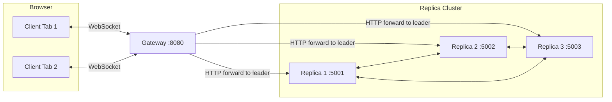
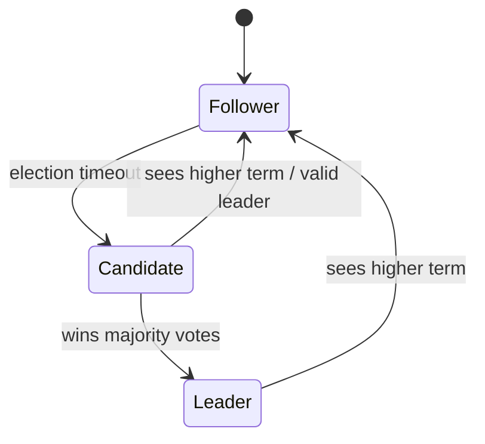

# MiniRAFT Architecture

## Services

## Cluster Diagram

The Gateway discovers the current leader via `/status` and forwards client strokes to the leader.
Replicas communicate using HTTP RPCs (`/request-vote`, `/append-entries`, `/heartbeat`, `/sync-log`).

1. Replica service (`services/replica`)
- Maintains RAFT-lite state (`Follower`, `Candidate`, `Leader`).
- Persists `currentTerm`, `votedFor`, append-only log, and `commitIndex`.
- Exposes RPC-like HTTP endpoints:
  - `POST /request-vote`
  - `POST /append-entries`
  - `POST /heartbeat`
  - `POST /sync-log`
- Exposes client helpers:
  - `POST /client/stroke` (leader only)
  - `GET /client/committed-log`

2. Gateway service (`services/gateway`)
- Accepts WebSocket clients.
- Forwards incoming stroke events to current leader.
- Broadcasts only committed entries to all clients.
- Re-discovers leader during elections/failover.

3. Frontend service (`services/frontend`)
- Canvas UI that sends stroke events over WebSocket.
- Applies initial snapshot then live committed updates.

## Consensus Rules Implemented

1. Election timeout randomized (`ELECTION_MIN_MS`..`ELECTION_MAX_MS`).
2. Heartbeat interval (`HEARTBEAT_MS`) from leader to followers.
3. Leader election by majority quorum in 3-node cluster.
4. Log append and majority acknowledgment before commit.
5. Step-down on higher term observation.
6. Restarted follower catch-up through `sync-log` path.

## State Transitions (RAFT-lite)

Notes:
- A `Follower` resets its election timer when receiving heartbeats/append entries from a current-term leader.
- A `Leader` sends periodic heartbeats to maintain authority and advance commit index.

## Restart Catch-Up Flow

1. Follower receives AppendEntries/Heartbeat with `prevLogIndex` it cannot satisfy.
2. Follower triggers asynchronous `POST /sync-log` call to the current leader address.
3. Leader returns committed entries from follower's `fromIndex`.
4. Follower appends missing committed entries and advances `commitIndex`.
5. Normal heartbeat/append resumes.

## API Definition

Replica HTTP endpoints:
- `GET /health` → `{ ok: true }`
- `GET /status` → `{ nodeId, state, currentTerm, votedFor, leaderId, leaderAddress, advertiseAddress, commitIndex, logLength }`
- `POST /request-vote` → `{ term, voteGranted }`
- `POST /heartbeat` → `{ term, success, matchIndex }`
- `POST /append-entries` → `{ term, success, matchIndex }`
- `POST /sync-log` (leader receives from follower) → `{ term, entries, commitIndex }`
- `POST /client/stroke` (leader only)
  - Request: `{ stroke }`
  - Response success: `{ ok: true, entry }`
  - Response not leader: `409 { ok: false, reason: "not_leader", leaderId }`
- `GET /client/committed-log` → `{ ok: true, nodeId, commitIndex, entries }`

Gateway HTTP + WebSocket:
- `GET /health` → `{ ok: true }`
- `GET /status` → `{ ok: true, leader, replicas }`
- `WS /`:
  - Client → Gateway: `{ type: "stroke", stroke }`
  - Gateway → Client snapshot: `{ type: "snapshot", entries }`
  - Gateway → Client committed: `{ type: "stroke", entry }`

Frontend:
- Serves static assets on `/` (canvas app) and connects to the Gateway WebSocket.

## Deployment

`docker-compose.yml` starts:
- 3 replicas with unique `NODE_ID` and `ADVERTISE_ADDR`
- 1 gateway
- 1 frontend

Each replica uses a dedicated Docker volume for persisted state.

## Observability

Structured JSON logs include:
- `service`
- `nodeId`
- `term`
- `state`
- `commitIndex`
- `eventType`

Common `eventType` values:
- `election_started`, `election_lost`, `vote_granted`, `became_leader`, `step_down`
- `entries_appended`, `entry_committed`, `catchup_applied`

## Failure-Handling Design

- **Leader failure:** followers time out, start an election, and a new leader is elected by majority.
- **Outdated leader:** any node observing a higher term steps down to follower.
- **Restarted node catch-up:** follower detects a log mismatch and pulls committed entries via `/sync-log`.
- **Gateway routing:** Gateway re-discovers leader and retries on `409 not_leader`.
